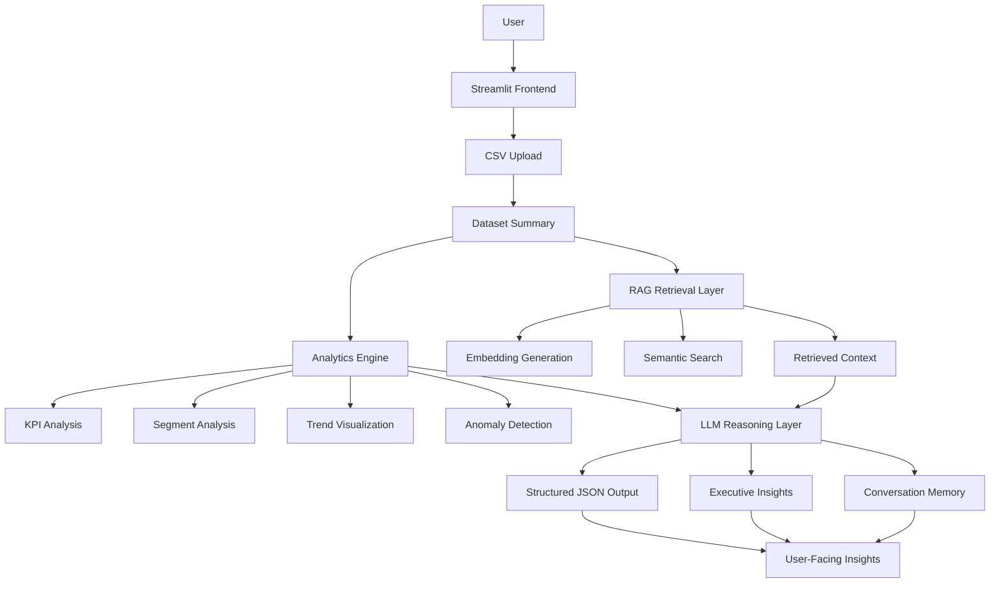
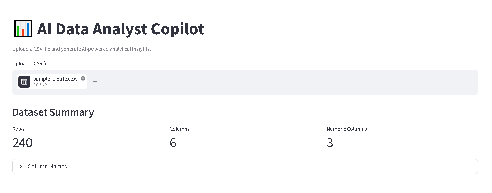
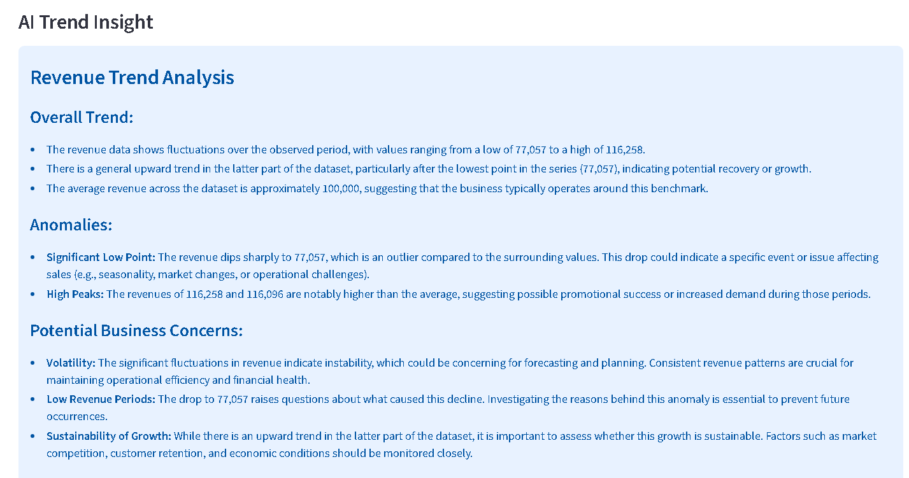
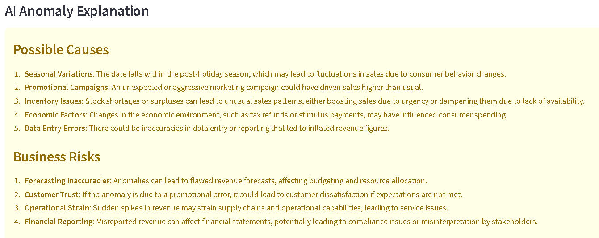

# AI Data Analyst Copilot

An AI-powered analytics assistant that combines retrieval-augmented generation (RAG), semantic retrieval, structured reasoning, visualization, anomaly detection, and conversation memory to generate grounded insights from uploaded datasets.

---

## Features

- CSV ingestion and dataset summarization
- KPI analysis and segment comparison
- AI-generated executive insights
- Semantic retrieval using embeddings
- Retrieval-Augmented Generation (RAG)
- Conversation memory
- Revenue trend visualization
- Anomaly detection and explanation
- Interactive Streamlit frontend
- Downloadable AI insights report

---

## Architecture



---

## Screenshots

### Main Dashboard



### Trend Analysis



### Anomaly Detection



---

## Tech Stack

- Python
- OpenAI API
- Streamlit
- Pandas
- NumPy
- Matplotlib

---

## Key AI Concepts Implemented

- Retrieval-Augmented Generation (RAG)
- Semantic Search with Embeddings
- Structured JSON Outputs
- Conversation Memory
- AI-Assisted Analytics
- Anomaly Detection
- Executive Insight Generation

---

## Run Locally

```bash
pip install -r requirements.txt
streamlit run streamlit_app.py
```

---

## Future Improvements

- Vector database integration
- Multi-dataset support
- SQL query integration
- Advanced anomaly detection
- Real-time analytics pipelines
- Role-based analytics workflows

---

## Project Motivation

This project was designed to explore how modern LLM systems can assist analytical workflows beyond simple chatbot interactions by combining retrieval, structured reasoning, business analytics, and conversational interfaces.