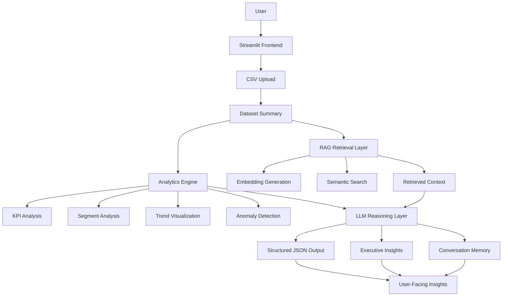

# AI Data Analyst Copilot

An AI-powered analytics assistant that combines retrieval-augmented generation (RAG), semantic retrieval, structured reasoning, visualization, and anomaly detection to generate grounded insights from uploaded datasets.

## Features

- CSV upload and summarization
- Semantic retrieval using embeddings
- Conversation memory
- Structured JSON outputs
- Revenue trend visualization
- AI-generated analytical insights
- Anomaly detection and explanation
- Streamlit frontend

## Tech Stack

- Python
- OpenAI API
- Streamlit
- Pandas
- NumPy
- Matplotlib

## Architecture



## Screenshots

### Trend Visualization


### AI Insight Generation


## Run Locally

```bash
pip install -r requirements.txt
streamlit run streamlit_app.py
```